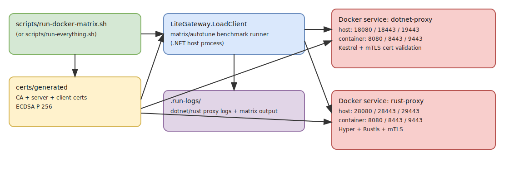

# Lite Gateway Benchmark Scaffold

Benchmark scaffold for comparing a **.NET 10 Native AOT** and a **Rust (Hyper + Rustls)** mTLS reverse-proxy under identical load. The goal is to measure throughput, latency, and connection-handling across HTTP, HTTPS, and mTLS — with and without connection reuse.



## Components

| Component | Path | Description |
| --- | --- | --- |
| **.NET Proxy** | `src/LiteGateway.Proxy` | Kestrel-based, allocation-conscious reverse proxy |
| **Rust Proxy** | `src/LiteGateway.Proxy.Rust` | Hyper + Rustls equivalent with identical endpoint model |
| **Load Client** | `src/LiteGateway.LoadClient` | Async load generator with TUI dashboard and autotune |
| **Cert Generator** | `scripts/generate-mtls-certs.sh` | ECDSA P-256 CA / server / client cert generation |

Both proxies expose three endpoints: HTTP (`:8080`), HTTPS (`:8443`), and mTLS (`:9443`). In standalone mode each applies a configurable async delay (default 5 s) then echoes the request JSON.

## Prerequisites

- .NET 10 SDK
- Rust stable toolchain + Cargo
- OpenSSL

## Quick Start

```bash
# 1. Generate mTLS certificates
./scripts/generate-mtls-certs.sh certs/generated
source certs/generated/mtls.env

# 2. Start a proxy
dotnet run --project src/LiteGateway.Proxy/LiteGateway.Proxy.csproj          # .NET
cargo run --manifest-path src/LiteGateway.Proxy.Rust/Cargo.toml --release    # Rust

# 3. Run the load client (single target)
dotnet run --project src/LiteGateway.LoadClient/LiteGateway.LoadClient.csproj -- \
  --url https://localhost:9443/api/test \
  --cert-pfx "$CLIENT_PFX" --cert-password "$CLIENT_PFX_PASSWORD" \
  --custom-ca "$CLIENT_CA_CERT" \
  --concurrency 1024 --duration 60 --http-version 2

# 4. Run the full 6-scenario matrix with autotune
dotnet run --project src/LiteGateway.LoadClient/LiteGateway.LoadClient.csproj -- --mode matrix
```

The matrix covers all six scenario combinations:
**http** / **https** / **https+mTLS** × **connection reuse** / **no reuse**

## Run Modes

### Host automation (`run-everything.sh`)

Generates certs, builds both proxies + load client, then runs the matrix on bare-metal.

```bash
./scripts/run-everything.sh --quick --proxy both   # fast profile (recommended)
./scripts/run-everything.sh --full  --proxy both   # full profile (longer)
```

| Flag | Effect |
| --- | --- |
| `--proxy <dotnet\|rust\|both>` | Proxy implementation(s) to test |
| `--quick` / `--full` | Fast matrix (8 s/run) vs full defaults (20 s/run) |
| `--sleep-ms <ms>` | Per-request proxy delay (default 5000) |
| `--skip-build` | Skip build step |
| `--skip-certs` | Reuse existing certificates |

Logs: `.run-logs/` (`dotnet-proxy.log`, `rust-proxy.log`, `*-matrix.log`).

### Docker automation (`run-docker-matrix.sh`)

Same workflow but proxies run in Docker; load client runs on the host.

```bash
./scripts/run-docker-matrix.sh --quick --proxy both
./scripts/run-docker-matrix.sh --full  --proxy both
```

Docker port mapping:

| Proxy | HTTP | HTTPS | mTLS |
| --- | --- | --- | --- |
| .NET | `18080` | `18443` | `19443` |
| Rust | `28080` | `28443` | `29443` |

Logs: `.run-logs/docker/`.

### JMeter test plan (`run-jmeter-testplan.sh`)

Runs `specs/jmeter/TestPlan.jmx` in non-GUI mode with mTLS client certs. Validates zero failed samples/assertions.

```bash
./scripts/run-jmeter-testplan.sh --proxy both               # default scale
./scripts/run-jmeter-testplan.sh --proxy both --high-scale   # high-scale preset
./scripts/run-jmeter-testplan.sh --proxy both \
  --threads 20000 --ramp-seconds 45 --loops 12               # custom scale
```

Logs: `.run-logs/jmeter/`.

## Performance Tips

For realistic numbers, publish **Release Native AOT** binaries instead of `dotnet run`:

```bash
dotnet publish src/LiteGateway.Proxy/LiteGateway.Proxy.csproj -c Release -r osx-arm64 --self-contained true /p:PublishAot=true
dotnet publish src/LiteGateway.LoadClient/LiteGateway.LoadClient.csproj -c Release -r osx-arm64 --self-contained true /p:PublishAot=true
```

### Duration defaults

| Mode | Parameter | Default |
| --- | --- | --- |
| Single run | `--duration` | 60 s |
| Matrix (per attempt) | `--matrix-run-duration` | 20 s |
| Quick profile override | — | 8 s |

Full matrix usually completes in 12–22 min with defaults.

## Benchmark Results

All numbers are **successful requests per second (RPS)** — higher is better.

### Docker quick-run (`--quick --proxy both`)

Short 8 s runs with default 5 s proxy delay, so absolute RPS is low; useful for comparative ranking.

| Scenario | .NET (RPS) | Rust (RPS) |
| --- | ---: | ---: |
| http-reuse | 19.43 | 20.90 |
| http-no-reuse | 19.42 | 19.42 |
| https-reuse | 25.91 | 24.91 |
| https-no-reuse | 19.87 | 19.41 |
| https-mtls-reuse | 20.56 | 20.03 |
| https-mtls-no-reuse | 19.40 | 19.41 |

### Local native full run (Release AOT, same machine)

| Scenario | .NET (RPS) | Rust (RPS) |
| --- | ---: | ---: |
| http-reuse | 1025.98 | 1048.16 |
| http-no-reuse | 732.59 | 510.12 |
| https-reuse | 1092.05 | 1091.01 |
| https-no-reuse | 245.50 | 617.07 |
| https-mtls-reuse | 1091.88 | 1090.88 |
| https-mtls-no-reuse | 116.02 | 200.19 |

**Takeaways:**
- With connection reuse, throughput is effectively tied (~1.09 k RPS) across HTTPS and mTLS.
- Without reuse (TLS handshake-heavy), Rust shows higher throughput in this sample.
- Peak observed: **~1526 RPS** (HTTP/2, mTLS, high concurrency, local-machine dependent).

## Specs

See `specs/ABSTRACT_SPEC.md` and the source requirement documents in `specs/`.
