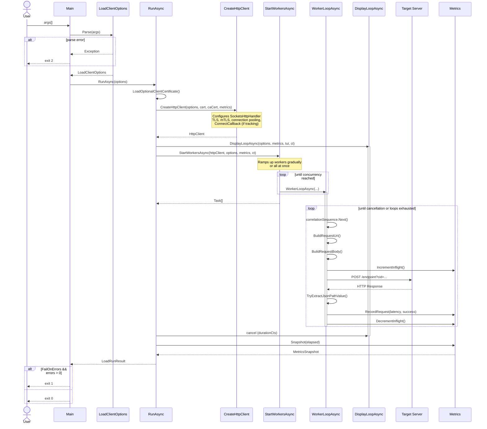
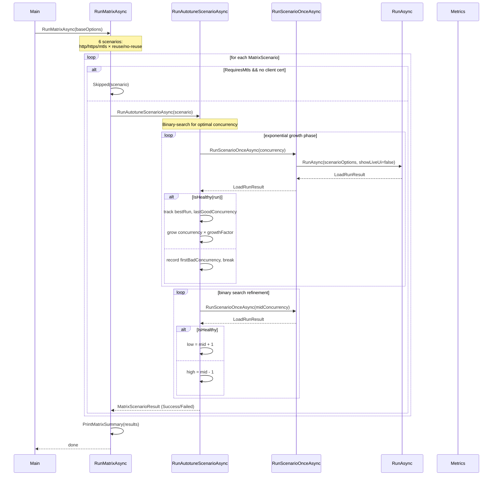
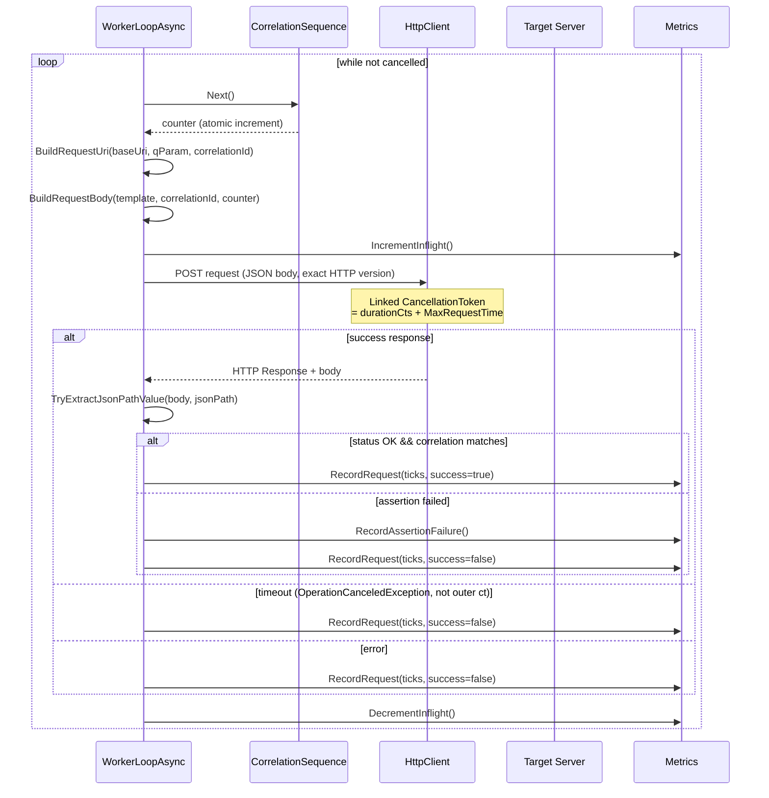

# LiteGateway.LoadClient — Sequence Diagram

## Single Mode Flow

```mermaid
sequenceDiagram
    actor User
    participant Main
    participant Options as LoadClientOptions
    participant RunAsync
    participant CreateHttpClient
    participant StartWorkers as StartWorkersAsync
    participant Worker as WorkerLoopAsync
    participant Display as DisplayLoopAsync
    participant Target as Target Server
    participant Metrics

    User->>Main: args[]
    Main->>Options: Parse(args)
    alt parse error
        Options-->>Main: Exception
        Main-->>User: exit 2
    end
    Options-->>Main: LoadClientOptions

    Main->>RunAsync: RunAsync(options)

    RunAsync->>RunAsync: LoadOptionalClientCertificate()
    RunAsync->>CreateHttpClient: CreateHttpClient(options, cert, caCert, metrics)
    Note over CreateHttpClient: Configures SocketsHttpHandler<br/>TLS, mTLS, connection pooling,<br/>ConnectCallback (if tracking)
    CreateHttpClient-->>RunAsync: HttpClient

    RunAsync->>Display: DisplayLoopAsync(options, metrics, tui, ct)
    activate Display

    RunAsync->>StartWorkers: StartWorkersAsync(httpClient, options, metrics, ct)
    Note over StartWorkers: Ramps up workers gradually<br/>or all at once
    loop until concurrency reached
        StartWorkers->>Worker: WorkerLoopAsync(...)
        activate Worker
    end
    StartWorkers-->>RunAsync: Task[]

    loop until cancellation or loops exhausted
        Worker->>Worker: correlationSequence.Next()
        Worker->>Worker: BuildRequestUri()
        Worker->>Worker: BuildRequestBody()
        Worker->>Metrics: IncrementInflight()
        Worker->>Target: POST /endpoint?cid=...
        Target-->>Worker: HTTP Response
        Worker->>Worker: TryExtractJsonPathValue()
        Worker->>Metrics: RecordRequest(latency, success)
        Worker->>Metrics: DecrementInflight()
    end
    deactivate Worker

    RunAsync->>Display: cancel (durationCts)
    deactivate Display

    RunAsync->>Metrics: Snapshot(elapsed)
    Metrics-->>RunAsync: MetricsSnapshot
    RunAsync-->>Main: LoadRunResult

    alt FailOnErrors && errors > 0
        Main-->>User: exit 1
    else
        Main-->>User: exit 0
    end
```

## Matrix / Autotune Mode Flow

```mermaid
sequenceDiagram
    participant Main
    participant RunMatrix as RunMatrixAsync
    participant Autotune as RunAutotuneScenarioAsync
    participant RunOnce as RunScenarioOnceAsync
    participant RunAsync
    participant Metrics

    Main->>RunMatrix: RunMatrixAsync(baseOptions)
    Note over RunMatrix: 6 scenarios:<br/>http/https/mtls × reuse/no-reuse

    loop for each MatrixScenario
        alt RequiresMtls && no client cert
            RunMatrix->>RunMatrix: Skipped(scenario)
        else
            RunMatrix->>Autotune: RunAutotuneScenarioAsync(scenario)

            note over Autotune: Binary-search for optimal concurrency
            loop exponential growth phase
                Autotune->>RunOnce: RunScenarioOnceAsync(concurrency)
                RunOnce->>RunAsync: RunAsync(scenarioOptions, showLiveUi=false)
                RunAsync-->>RunOnce: LoadRunResult
                RunOnce-->>Autotune: LoadRunResult

                alt IsHealthy(run)
                    Autotune->>Autotune: track bestRun, lastGoodConcurrency
                    Autotune->>Autotune: grow concurrency × growthFactor
                else
                    Autotune->>Autotune: record firstBadConcurrency, break
                end
            end

            loop binary search refinement
                Autotune->>RunOnce: RunScenarioOnceAsync(midConcurrency)
                RunOnce-->>Autotune: LoadRunResult
                alt IsHealthy
                    Autotune->>Autotune: low = mid + 1
                else
                    Autotune->>Autotune: high = mid - 1
                end
            end

            Autotune-->>RunMatrix: MatrixScenarioResult (Success/Failed)
        end
    end

    RunMatrix->>RunMatrix: PrintMatrixSummary(results)
    RunMatrix-->>Main: done
```

## Worker HTTP Request Detail

```mermaid
sequenceDiagram
    participant Worker as WorkerLoopAsync
    participant Seq as CorrelationSequence
    participant Client as HttpClient
    participant Target as Target Server
    participant Metrics

    loop while not cancelled
        Worker->>Seq: Next()
        Seq-->>Worker: counter (atomic increment)
        Worker->>Worker: BuildRequestUri(baseUri, qParam, correlationId)
        Worker->>Worker: BuildRequestBody(template, correlationId, counter)
        Worker->>Metrics: IncrementInflight()

        Worker->>Client: POST request (JSON body, exact HTTP version)
        Note over Client: Linked CancellationToken<br/>= durationCts + MaxRequestTime

        alt success response
            Client-->>Worker: HTTP Response + body
            Worker->>Worker: TryExtractJsonPathValue(body, jsonPath)
            alt status OK && correlation matches
                Worker->>Metrics: RecordRequest(ticks, success=true)
            else assertion failed
                Worker->>Metrics: RecordAssertionFailure()
                Worker->>Metrics: RecordRequest(ticks, success=false)
            end
        else timeout (OperationCanceledException, not outer ct)
            Worker->>Metrics: RecordRequest(ticks, success=false)
        else error
            Worker->>Metrics: RecordRequest(ticks, success=false)
        end

        Worker->>Metrics: DecrementInflight()
    end
```
